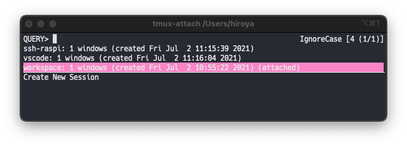

# peco-tmux.fish

This is a plugin to allow interactive selection and attachment of tmux sessions.

## Features



## Installation

First, install [peco](https://github.com/peco/peco), an interactive filtering tool.

Next, install this plugin with [Fisher](https://github.com/jorgebucaran/fisher).

```
fisher install Hiroya-W/peco-tmux.fish
```
